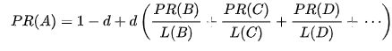

# Spider-Page-Ranking-Visualization
This set of programs emulate some of the functions of a search engine. The data is stored in a [SQLITE 3](https://www.sqlite.org) database name [spider.sqlite](../blob/master/spider.sqlite)

You need to download [DB browser](https://sqlitebrowser.org/dl/) to view and modify data.

## Libraries/Modules Used:
* **Beautiful Soup**
* **urllib**
* **ssl**
* **D3.v2.js**
* **sqlite3**
## Database Structure:

| id| URL                      | html            | error        | old_rank    | new_rank |  
|---|:--------------------------:|:---------------:|--------------|:-----------:|---------:|
| 1 | https://www.soundcloud.com | <html><head>... | NULL         | 0.3432134   | 0.289767 |
| 2 | https://www.soundcloud.com/discover | <!DOCTYPE html> | NULL         | 0.139642    | 0.14221  |
| 3 | https://www.soundcloud.com/upload | NULL            | -1           | NULL        | 1.0      |  

## USAGE
#### Execution of programs are done in following manner
* **spider.py:** This program crawls a web site and pulls a series of pages into the database, recording the links between pages. User is asked to enter a website followed by a '/' at the end and number of pages to spider. Using BeautifulSoup the anchor tags are extracted from the html. The retrieved urls are then stored with a initial page rank as 1.0. 

* **sprank.py:** Ranking of page is done using the Page Rank Algrotihm which is given by the expression: 

Where d is the damping factor and PR(B),PR(C).. are the **PR** of the inbound links to the page and L(B),L(C).. are the number of outbound links from their respective page. In this given file the damping factor is considered as 1. The amount of influence of a page to the **PR** of the pages of outbound links are determined and then added all the outbound links **PR**. Since the **PR** of pages with [no follow](https://en.wikipedia.org/wiki/Nofollow) attribute is wasted therefore **PR** of the page is evaporated and passed on.   
The data is saved in the database later whem the new ranks of the pages are obtained.

* **spdumps.py:** This file dumps the all the data of the page table in the database.

* **spjson.py:** This file write on a javascript file and extract the required nodes which are needed to be visualise and store them in spider.js

## NOTE:
1. Beautiful Soup python module is needed to be installed before you run the program.
2. Damping factor can be set between 0 to 1. 0.85 is preferred
3. The database file needs to be deleted to rerun the program.
4. Open force.html file to visualize the pagerank
5. To know more about **PR** algorithm click [here](https://www.geeksforgeeks.org/page-rank-algorithm-implementation/) 
